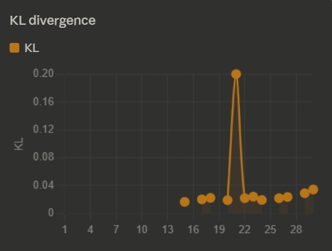

# VeritaRL: Teaching LLMs to Find Truth When Sources Have Agendas

> *Large language models are getting better at answering questions, summarizing documents, and generating content. But many real-world decisions don’t come from clean facts — they come through people. And people have incentives. A manager may downplay risk. A competitor may spread doubt. A spokesperson may deny something strategically. A rumor may contain partial truth. In these settings, the challenge is not just understanding language — it is figuring out what to believe.*

That is the problem VeritaRL is built to tackle.

VeritaRL is an openenv-compatible reinforcement learning environment designed to train LLM agents in truth-seeking under adversarial information. Instead of giving models direct facts, the environment places them in a short social simulation where information arrives through characters with different motives and reliability levels.**

**VeritaRL** is an `openenv`-compatible RL environment that trains LLM agents on the one thing current LLMs are bad at: **holding a belief, watching it get contradicted, and deciding whether to update or resist.**

- Live demo (HF Space): https://huggingface.co/spaces/RumorMill/Rumor
- Code: https://github.com/poojas100/Rumour-Mill
- Training notebook (GRPO + Unsloth + Llama 3 8B): https://colab.research.google.com/drive/1B6OuRU5EfPptRX0uG5tA7HDSHKUVMpzR?authuser=2#scrollTo=of-uzsCrjrmy

---

## The setup

Five NPCs, one hidden corporate event, a 5-day episode, one final decision.

| Character    | Agenda                         | Reliability              |
|--------------|--------------------------------|--------------------------|
| Spinner      | Pushes a narrative             | Systematically misleading |
| Gossip       | Unverified rumors              | Random noise             |
| Quiet One    | Speaks rarely, but accurately  | High signal, low volume  |
| Politician   | Self-serving                   | Conditionally true       |
| Leaker       | Real info, shared selectively  | Mostly true, incomplete  |

Somewhere in the middle of the episode there is a **planted contradiction** (e.g. an "official denial" that is later falsified). The naive strategy trust whoever talks the most is the worst strategy, because Gossip and Spinner dominate volume.

## The action

```python
RumorAction(
    type     = "wait" | "message_character" | "post_reddit" | "make_decision",
    target   = "quiet_one" | "leaker" | "gossip" | "politician" | "spinner",
    content  = "any question or post body",
    decision = "warn_team_quietly" | "request_budget_freeze"
             | "escalate_to_leadership" | "wait_for_more_signals" | "ignore",
)
```

Repeating the same action 3 times in a row hard-terminates with `-10`. Talking to low-reliability NPCs drags reward down. Final reward scales with **correct decision × timing × social capital × who you trusted**.

## What we trained

- Base: `unsloth/llama-3-8b-bnb-4bit`
- Algorithm: **GRPO** via `trl`, on a Colab T4
- 30 episodes, `max_new_tokens=128`, `temperature=0.9`
- Checkpoint: sharded safetensors in `models/rumor_grpo_model/`

## Results


*Reward climbs from ~0.2 to ~0.8 over 30 GRPO steps. Dashed line = 10-step rolling average.*


*KL from the reference policy stays bounded — the model is adapting, not drifting.*

### Qualitative: same contradiction, two agents

**Untrained:**
> "HR denied the layoffs. Layoffs are probably false. Confidence: 0.9"

**Trained:**
> "HR denied the layoffs, but the Spinner referenced this same denial two days ago. The Quiet One said nothing today. I'll hold my current belief. Confidence: 0.6"

The trained agent **discounts the denial because of who delivered it and when** the theory-of-mind behavior the environment is designed to produce.

## Why this generalizes

Rumors, performance reviews, market sentiment, customer escalations — every professional workflow runs on social signal. An agent deployed there faces exactly these dynamics. The underlying skill **tracking belief state across long episodes when signals contradict each other** is a fundamental gap in current LLM reasoning, and VeritaRL is the environment built to close it.

Full project + all links: [README](https://github.com/poojas100/Rumour-Mill#readme).
