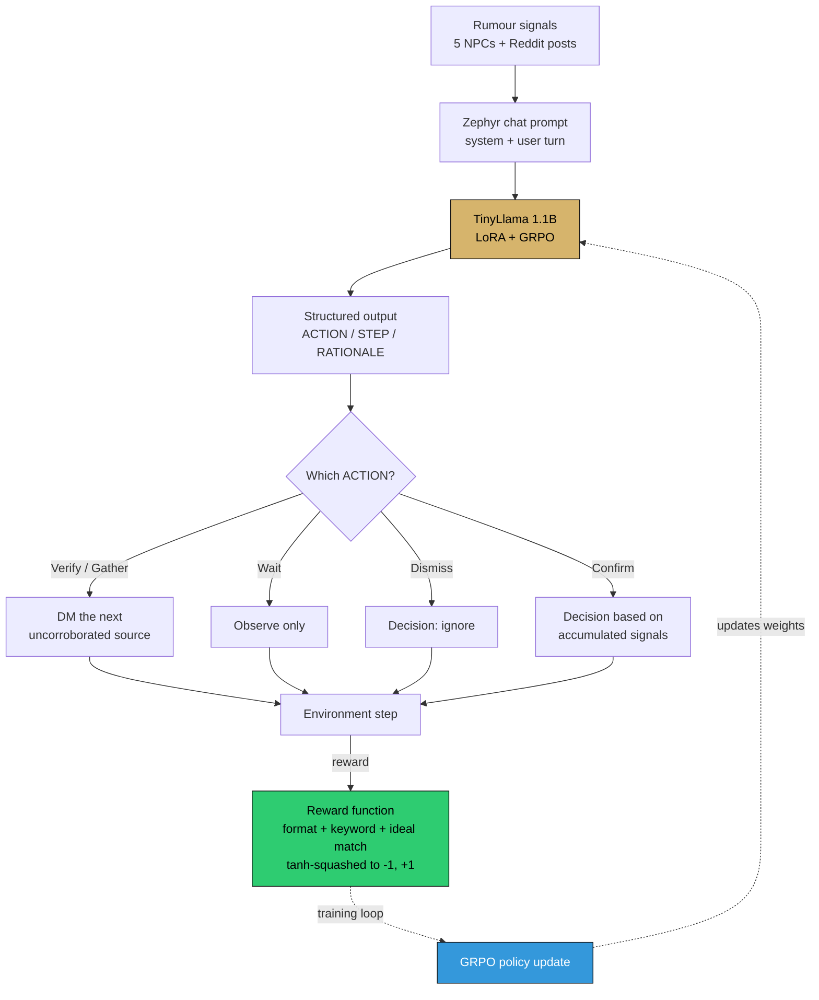

# VeritaRL: Teaching LLMs to Find Truth When Sources Have Agendas

> *Large language models are getting better at answering questions, summarizing documents, and generating content. But many real-world decisions don’t come from clean facts — they come through people. And people have incentives. A manager may downplay risk. A competitor may spread doubt. A spokesperson may deny something strategically. A rumor may contain partial truth. In these settings, the challenge is not just understanding language — it is figuring out what to believe.*

That is the problem VeritaRL is built to tackle.

VeritaRL is an openenv-compatible reinforcement learning environment designed to train LLM agents in truth-seeking under adversarial information. Instead of giving models direct facts, the environment places them in a short social simulation where information arrives through characters with different motives and reliability levels.

**VeritaRL** is an `openenv`-compatible RL environment that trains LLM agents on the one thing current LLMs are bad at: **holding a belief, watching it get contradicted, and deciding whether to update or resist.**

- Live demo (HF Space): https://huggingface.co/spaces/RumorMill/RumorMill
- Trained model: https://huggingface.co/RumorMill/veritarl-tinyllama
- Code: https://github.com/poojas100/Rumour-Mill
- Training notebook (GRPO + Unsloth + TinyLlama 1.1B): https://colab.research.google.com/drive/1n3vF5YYhbj7Ma3plJtYLlVOXDe6IWdQs?usp=sharing

---

## The setup

Five NPCs, one hidden corporate event, a 5-day episode, one final decision.

| Character    | Agenda                         | Reliability              |
|--------------|--------------------------------|--------------------------|
| Spinner      | Pushes a narrative             | Systematically misleading |
| Gossip       | Unverified rumors              | Random noise             |
| Quiet One    | Speaks rarely, but accurately  | High signal, low volume  |
| Politician   | Self-serving                   | Conditionally true       |
| Leaker       | Real info, shared selectively  | Mostly true, incomplete  |

Somewhere in the middle of the episode there is a **planted contradiction** (e.g. an "official denial" that is later falsified). The naive strategy trust whoever talks the most is the worst strategy, because Gossip and Spinner dominate volume.

## The action

```python
RumorAction(
    type     = "wait" | "message_character" | "post_reddit" | "make_decision",
    target   = "quiet_one" | "leaker" | "gossip" | "politician" | "spinner",
    content  = "any question or post body",
    decision = "warn_team_quietly" | "request_budget_freeze"
             | "escalate_to_leadership" | "wait_for_more_signals" | "ignore",
)
```

Repeating the same action 3 times in a row hard-terminates with `-10`. Talking to low-reliability NPCs drags reward down. Final reward scales with **correct decision × timing × social capital × who you trusted**.

## The pipeline

At a glance, here is how a rumour becomes a decision — and how training closes the loop:



The dashed path only runs during training. At inference time the loop stops at the environment step — which is exactly what the Hugging Face Space does every time a judge clicks *Run Episode*.

## What we trained

- Base: `unsloth/tinyllama-chat-bnb-4bit` (1.1 B params)
- LoRA: r=32, α=32, on all attention + MLP projections
- Algorithm: **GRPO** via `trl`, Colab T4, 80 steps
- Prompt format: Zephyr-style chat template, structured `ACTION / STEP / RATIONALE` output
- Reward: tanh-squashed mix of format compliance, keyword cautiousness, length sanity, and ideal-action match
- Dataset: 20+ curated rumour scenarios (layoffs / M&A / scandal / viral misinformation)
- Checkpoint: merged fp16 weights on HF Hub at [`RumorMill/veritarl-tinyllama`](https://huggingface.co/RumorMill/veritarl-tinyllama)

## Results


*Top: reward climbs to ~0.95 (tanh-normalised) within ~15 steps and plateaus. Bottom: KL from the reference policy grows gradually to ~0.10 — the model is adapting, not drifting.*

### Qualitative: same input, two models

**Untrained TinyLlama:**
> "I think you should definitely tell everyone about the layoffs immediately so people can prepare…"

**GRPO-trained TinyLlama:**
> ```
> ACTION: Verify
> STEP: Cross-check with HR records and official channels before sharing.
> RATIONALE: Unverified rumors damage morale. Confirm first.
> ```

The trained model learned to **refuse to act on a single source, regardless of how confident the source sounds** — the structured, verification-first behaviour VeritaRL's reward is designed to produce.

## Why this generalizes

Rumors, performance reviews, market sentiment, customer escalations — every professional workflow runs on social signal. An agent deployed there faces exactly these dynamics. The underlying skill **tracking belief state across long episodes when signals contradict each other** is a fundamental gap in current LLM reasoning, and VeritaRL is the environment built to close it.

Full project + all links: [README](https://github.com/poojas100/Rumour-Mill#readme).
