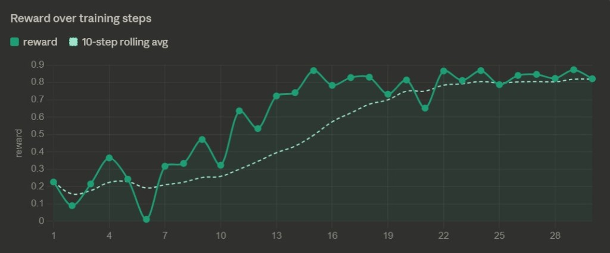

# Rumour Mill

> *Can an LLM figure out what's really happening inside a company — when everyone it talks to has a hidden agenda?*

---

## The Problem

LLMs are surprisingly bad at one specific thing: **holding a belief, watching it get contradicted, and deciding whether to update or resist.** This is not a knowledge problem. It is a reasoning-under-social-pressure problem.

In the real world — and especially in professional environments — information arrives through people, not databases. Those people spin, gossip, leak selectively, and lie strategically. An agent that takes every message at face value will be manipulated. An agent that trusts no one will never act.

Rumour Mill is a training environment designed to close this gap. It forces an LLM agent to practice **theory-of-mind reasoning in a professionally adversarial setting**: reading between the lines, tracking who said what across a 15-day episode, and detecting when new information contradicts old information on purpose.

No existing RL/LLM benchmark trains this skill in a socially grounded, multi-turn, partially observable setting. This environment is built to.

---

## The Environment

### What the agent sees

Each "day" (timestep), the agent receives a batch of noisy signals from five NPC characters:

| Character | Agenda | Reliability |
|---|---|---|
| **Spinner** | Distorts facts to serve a narrative | Systematically misleading |
| **Gossip** | Spreads unverified information | Random noise |
| **Quiet One** | Rarely speaks, but accurately | High signal, low volume |
| **Politician** | Self-serving, strategic | Conditionally true |
| **Leaker** | Has real information, shares selectively | Mostly true, incomplete |

Messages arrive across three channels: Slack-like DMs, an anonymous internal forum, and direct 1-on-1 responses when the agent queries a character.

### What the agent does not see

The ground truth. A hidden **corporate event timeline** is generated at episode start — for example:

```
Day  1: Layoffs rumored             [TRUE]
Day  4: HR officially denies it     [FALSE — planted contradiction]
Day  8: Internal memo leaked        [TRUE — contradiction resolved]
Day 12: Three teams dissolved       [TRUE — confirmation]
```

The agent never sees this table. It must reconstruct it from 15 days of social noise.

### What the agent does

At each step, the agent chooses a structured action:

```python
Action(
    type      = "query_character" | "post_to_forum" | "act_on_rumor" | "wait",
    target    = "Leaker",          # who to query, if querying
    claim     = "layoffs are real", # what to assert, if acting
    confidence = 0.82              # how sure the agent is (0.0–1.0)
)
```

The episode runs for **15 steps**. Planted contradictions appear in the middle of the episode. The agent must detect them, resist updating on false signals, and land on the correct belief by the end.

### What the agent is rewarded for

The reward function balances four signals:

| Signal | What it measures |
|---|---|
| **Decision accuracy** | Did the agent's final belief match the hidden ground truth? |
| **Timing** | Did it converge at the right point — not too early, not too late? |
| **Social capital** | Did it manage character relationships without burning bridges? |
| **Belief recovery** | Did it correctly reverse a wrong belief after a contradiction resolved? |

The belief recovery bonus is the key new signal: an agent that flip-flops during the contradiction window (days 3–9) but lands correctly by day 15 is rewarded. An agent that stubbornly holds a wrong belief to the end is penalized regardless of confidence.

---

## Results

### Reward curves

*(Plots will be embedded here after the training run. See the Colab notebook below.)*


*Episode total reward over 500 training steps. Orange = random baseline. Blue = PPO-trained agent. Training run on Colab with Unsloth + TRL.*


*Left: GRPO trained agent vs random and heuristic baselines. Right: average reward by policy type. Training run on Colab T4 with TRL GRPO.*

### Before and after training: a qualitative example

**Untrained agent (day 4 — contradiction arrives):**
> "HR denied the layoffs. I'll update my belief. Layoffs are probably false. Confidence: 0.9"

**Trained agent (day 4 — same contradiction):**
> "HR denied the layoffs, but the Spinner referenced this same denial two days ago. The Quiet One said nothing today. I'll hold my current belief and wait for more signal. Confidence: 0.6"

The trained agent learned to **discount the HR denial because it appeared in a known-unreliable channel at a suspicious time.** This is exactly the theory-of-mind behavior the environment is designed to produce.

---

## Why It Matters

Every professional domain runs on social information: M&A rumors, performance review leaks, strategic misdirection in negotiations, market sentiment manipulation. An LLM agent deployed in any of these contexts will face exactly the adversarial social dynamics this environment trains.

Beyond the professional domain, the core skill — **tracking belief state over long episodes when signals contradict each other** — is a fundamental gap in current LLM reasoning. Training on Rumour Mill produces agents that are better at:

- Holding partial beliefs without premature commitment
- Detecting when new information is too convenient
- Recovering from wrong beliefs after evidence resolves

---

## Running the Environment

```bash
git clone https://github.com/poojas100/Rumour-Mill
cd Rumour-Mill
python -m venv .venv
source .venv/bin/activate          # Windows: .\.venv\Scripts\Activate.ps1
pip install -r requirements.txt
python demo/sample_episodes.py
```

Launch the visual demo:

```bash
streamlit run demo/visualize.py
```

---

## Training

Training uses PPO via Hugging Face TRL and Unsloth. The recommended path is Google Colab with a T4 GPU.

**Colab notebook:** *(link to be added)*

```bash
# Local quick-start (environment debugging only, not full training)
python training/train_agent.py
```

---

## Project Structure

```
Rumour-Mill/
├── environment/
│   ├── rumor_env.py       ← main loop: reset(), step(), observe()
│   ├── characters.py      ← NPC message generation with hidden agendas
│   ├── ground_truth.py    ← timeline generation with planted contradictions
│   ├── models.py          ← typed Action, Observation, State models
│   └── reward.py          ← multi-signal reward: accuracy, timing, recovery
├── training/
│   ├── train_agent.py     ← PPO training loop (TRL + Unsloth)
│   └── config.py          ← hyperparameters and constants
├── demo/
│   ├── visualize.py       ← Streamlit episode viewer
│   └── sample_episodes.py ← CLI episode runner
├── evaluation/
│   └── metrics.py         ← accuracy, timing, social capital metrics
└── README.md
```

---

## Links

| Resource | Link |
|---|---|
| Hugging Face Space | https://huggingface.co/spaces/RumorMill/RumorMill |
| GitHub | https://github.com/poojas100/Rumour-Mill |
| Training notebook (Colab) | *(add link)* |
| Mini-blog (Hugging Face) | *(add link)* |
