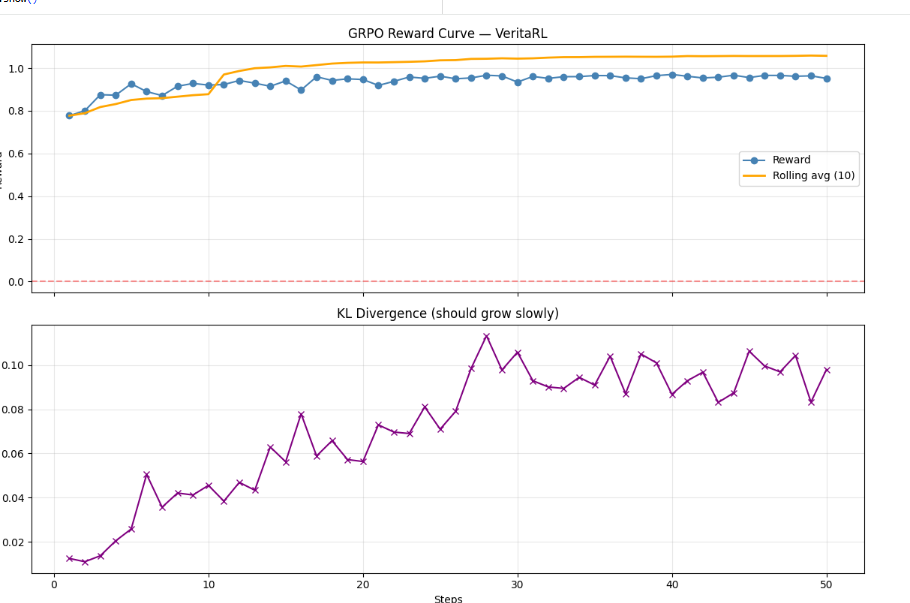

# VeritaRL

> *Can an LLM figure out what's really happening inside a company  when everyone it talks to has a hidden agenda?*

**VeritaRL** is an `openenv` compatible RL environment for training and evaluating LLM agents on **theory-of-mind reasoning under social pressure**: five NPCs with different agendas send noisy signals across several days, a ground-truth corporate event is hidden from the agent, and the agent has to **query, wait, post, and finally decide** while managing its social capital.

- Hugging Face Space (interactive demo): https://huggingface.co/spaces/RumorMill/RumorMill
- Trained model: https://huggingface.co/RumorMill/veritarl-tinyllama
- GitHub: https://github.com/poojas100/Rumour-Mill
- Training notebook (Colab, GRPO + Unsloth + TinyLlama 1.1B): https://colab.research.google.com/drive/1n3vF5YYhbj7Ma3plJtYLlVOXDe6IWdQs?usp=sharing
- Mini-blog: see [`BLOG.md`](BLOG.md) in this repo

---

## The Problem

LLMs are surprisingly bad at one specific thing: **holding a belief, watching it get contradicted, and deciding whether to update or resist.** This is not a knowledge problem. It is a reasoning-under-social-pressure problem.

In the real world and especially in professional environments information arrives through people, not databases. Those people spin, gossip, leak selectively, and lie strategically. An agent that takes every message at face value will be manipulated. An agent that trusts no one will never act.

VeritaRL is a training environment designed to close this gap. It forces an LLM agent to practice **theory-of-mind reasoning in a professionally adversarial setting**: reading between the lines, tracking who said what across an episode, and detecting when new information contradicts old information on purpose.

No existing RL/LLM benchmark trains this skill in a socially grounded, multi-turn, partially observable setting. This environment is built to.

---

## The Environment

### What the agent sees

Each "day" (timestep), the agent receives a batch of noisy signals from five NPC characters:

| Character      | Agenda                                     | Reliability              |
|----------------|--------------------------------------------|--------------------------|
| **Spinner**    | Distorts facts to serve a narrative        | Systematically misleading |
| **Gossip**     | Spreads unverified information             | Random noise             |
| **Quiet One**  | Rarely speaks, but accurately              | High signal, low volume  |
| **Politician** | Self-serving, strategic                    | Conditionally true       |
| **Leaker**     | Has real information, shares selectively   | Mostly true, incomplete  |

Messages arrive on three channels: Slack/Microsoft Teams-like DMs, an anonymous internal forum (`reddit_posts`), and direct 1-on-1 responses when the agent explicitly messages a character (`dm_response`).

### What the agent does not see

The **ground truth**. A hidden scenario is generated at episode start one of: `layoffs`, `revenue_miss`, `promotion_politics`, `acquisition`, `product_launch_fail`, `leadership_change`, `election_fraud`, `rug_pull`, etc. The scenario includes a timeline with **planted contradictions** (e.g. an official denial on day 2 that is later falsified on day 4).

The agent never sees this table. It must reconstruct it from the day-by-day social noise.

### What the agent does

At each step the agent returns a `RumorAction` (see `environment/models.py`):

```python
RumorAction(
    type     = "wait" | "message_character" | "post_reddit" | "make_decision",
    target   = "quiet_one" | "leaker" | "gossip" | "politician" | "spinner",   # when messaging
    content  = "any question / post body",                                      # when messaging or posting
    decision = "warn_team_quietly" | "request_budget_freeze"
             | "escalate_to_leadership" | "wait_for_more_signals" | "ignore",   # when deciding
)
```

The observation the agent receives each step is a `RumorObservation`:

```python
RumorObservation(
    messages, reddit_posts, conversations,     # social noise of the day
    day, social_capital,                       # bookkeeping
    dm_response, reactions,                    # reply to last message / reddit post
    ground_truth_revealed,                     # only set when the episode ends
    reward, done, reward_breakdown, metadata,
)
```

Each episode runs for **`max_days = 5`** by default (configurable in `RumorMillEnv.__init__`). The environment **auto-adjusts difficulty** across episodes based on the rolling reward window  see `RumorMillEnv.reset`.

### What the agent is rewarded for

`environment/reward.py` turns per-step actions into two components:

- **Per-step shaping** (`calculate_reward`): small bonuses for consulting reliable sources, small penalties for spamming, for repeated actions (≥3 in a row terminates the episode with `-10`), and for talking to low-reliability characters.
- **End-of-episode reward** (`calculate_final_reward`): big reward for the correct `make_decision` on the hidden scenario, scaled by timing, social capital, and how many reliable sources were queried.

The concrete correct-decision map is in `SCENARIO_CORRECT_DECISION` and per-character weights live in `SOURCE_RELIABILITY`.

---

## Results

### Training setup

- **Base model:** `unsloth/tinyllama-chat-bnb-4bit` (1.1 B params)
- **Fine-tuning:** LoRA (r=32, α=32, dropout=0.05) on all attention + MLP projections
- **Algorithm:** GRPO (via `trl`) on a single Colab T4
- **Hyperparameters:** `max_steps=80`, `lr=5e-5`, `num_generations=4`, `max_completion_length=128`, `temperature=0.9`, `beta=0.02` (KL)
- **Dataset:** 20+ curated rumour scenarios (layoffs / M&A / scandal / misinfo) with `ideal_response` annotations
- **Reward:** tanh-squashed combination of format-compliance, keyword cautiousness, length sanity, and ideal-action match
- **Checkpoint:** merged fp16 weights pushed to [`RumorMill/veritarl-tinyllama`](https://huggingface.co/RumorMill/veritarl-tinyllama); the Python version of the pipeline lives at `training/train_agent.py`.

### Training curves



*Top: reward climbs to ~0.95 (tanh-normalised) within ~15 steps and plateaus. Bottom: KL from the reference policy grows gradually to ~0.10 — the policy is adapting, not drifting.*

### Qualitative example

The trained agent produces structured, verification-first reasoning instead of impulsive confident output:

**Untrained TinyLlama, same input:**
> "I think you should definitely tell everyone about the layoffs immediately so people can prepare..."

**GRPO-trained TinyLlama:**
> ```
> ACTION: Verify
> STEP: Cross-check with HR records and official channels before sharing.
> RATIONALE: Unverified rumors damage morale. Confirm first.
> ```

The trained model learned to **refuse to act on a single source, regardless of how confident the source sounds.** This is the core theory-of-mind behavior VeritaRL is built to produce.

---

## Why It Matters

Every professional domain runs on social information: M&A rumors, performance review leaks, strategic misdirection in negotiations, market sentiment manipulation. An LLM agent deployed in any of these contexts will face exactly the adversarial social dynamics this environment trains.

Beyond the professional domain, the core skill  **tracking belief state over long episodes when signals contradict each other**  is a fundamental gap in current LLM reasoning. Training on VeritaRL produces agents that are better at:

- Holding partial beliefs without premature commitment
- Detecting when new information is too convenient
- Recovering from wrong beliefs after evidence resolves

---

## Running the Environment

### Install

```bash
git clone https://github.com/poojas100/Rumour-Mill
cd Rumour-Mill
python -m venv .venv
# Windows: .\.venv\Scripts\Activate.ps1
# macOS / Linux:
source .venv/bin/activate
pip install -r requirements.txt
```

`requirements.txt` installs the environment + Streamlit UI. **LLM inference** deps (`torch`, `transformers`, `accelerate`, `safetensors`) are in the same file but only needed if you plan to load the GRPO checkpoint locally. Use **CPU** or **CUDA** PyTorch wheels that **match each other**  a mismatched `torch` / `torchvision` pair is the most common install error on Windows.

### Optional: Ollama for richer NPC dialogue

Quiet One, Politician, and Leaker can call a local Ollama model for more varied messages. Skip this and the env quietly uses templates.

```bash
# 1. Install Ollama: https://ollama.com/download
ollama pull llama3       # pull the model the NPCs expect
ollama serve             # usually auto-started by the installer
pip install ollama       # already in requirements.txt
```

Verify with `ollama list`. To disable, stop the server or `pip uninstall ollama`.

### Demo modes

The demo script auto-detects whether model weights are present:

```bash
# Scripted epsilon-greedy agent, no weights, runs in seconds:
RUMOUR_DEMO=1 python demo/sample_episodes.py

# If models/rumor_grpo_model/ is fully populated, loads the full LLM:
python demo/sample_episodes.py

# Streamlit visualizer:
python -m streamlit run demo/visualize.py
```

Useful env vars (all optional):

| Var                  | Effect                                                                |
|----------------------|-----------------------------------------------------------------------|
| `RUMOUR_DEMO=1`      | Force scripted agent, never load weights                              |
| `RUMOUR_EPISODES=N`  | Number of episodes to sample (default 8)                              |
| `RUMOUR_VERBOSE=1`   | Full per-step logs                                                    |
| `RUMOUR_STEPS=1`     | Compact one-line action trace per episode                             |
| `RUMOUR_AGENT_LOG=1` | Print each scripted-agent decision (`[DEMO ...]`)                     |
| `RUMOUR_QUIET=1`     | Hide import banner                                                    |
| `RUMOUR_LOAD_WARN=1` | Show tokenizer / triton / deprecation warnings during model load      |

### HTTP server (openenv)

```bash
python -m server.app
```

Exposes the env over `openenv.core.server.run_server` so any RL client that speaks openenv can drive it.

---

## Project Structure

```
Rumour-Mill/
├── environment/
│   ├── rumor_env.py        ← main loop: reset(), step(), observe()
│   ├── characters.py       ← NPC message generation with hidden agendas
│   ├── ground_truth.py     ← scenario + timeline with planted contradictions
│   ├── models.py           ← typed Action / Observation / State (pydantic)
│   ├── reward.py           ← per-step + end-of-episode reward signals
│   └── tasks.py            ← env-factory entry points
├── demo/
│   ├── inference_agent.py  ← loads the GRPO checkpoint OR falls back to scripted agent
│   ├── sample_episodes.py  ← CLI episode runner, compact by default
│   └── visualize.py        ← Streamlit episode viewer
├── evaluation/
│   ├── baseline_agent.py   ← rule-based reference policy
│   └── metrics.py          ← accuracy, avg reward, ranking metrics
├── training/
│   ├── train_agent.py      ← reproducible GRPO+LoRA script (Python version of the Colab notebook)
│   └── config.py           ← TinyLlama + GRPO hyperparameters
├── server/
│   └── app.py              ← openenv HTTP server entrypoint
├── models/
│   └── rumor_grpo_model/   ← saved GRPO checkpoint (shards + tokenizer), not in git
├── requirements.txt
├── BLOG.md                 ← mini-blog draft (for Hugging Face post)
└── README.md
```
---
